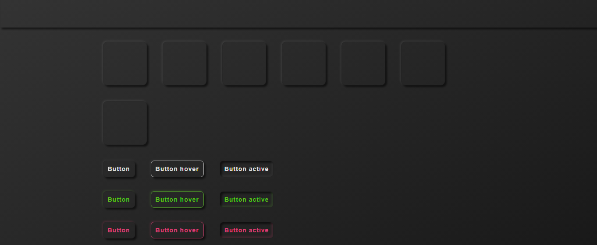

# neuromorphism-experiments
While looking for design ideas for my personal website, I stumbled upon the new trend of **neumorphic design**. In short, it tries to mimic the real world aesthetic and light behaviour of 'cards' stacked on top of eachother, and not as pieces of paper floating around (as is the case with Material Design).

In short this is done using a light shadow towards the light and a dark shadow opposite to it. Usually this is coupled with way less contrast between elements. Obviously the biggest challenge is providing accessability in this low-contrast environment.

## References
1. https://uxdesign.cc/neumorphism-in-user-interfaces-b47cef3bf3a6
2. https://medium.com/@artofofiare/neumorphism-the-right-way-a-2020-design-trend-386e6a09040a
3. https://medium.com/@katiemctigue/how-to-create-a-dark-mode-in-sass-609f131a3995
4. https://material.io/design/typography/the-type-system.html#type-scale
5. https://material.io/resources/color/#!/?view.left=0&view.right=0&primary.color=00C853&secondary.color=FF4081
